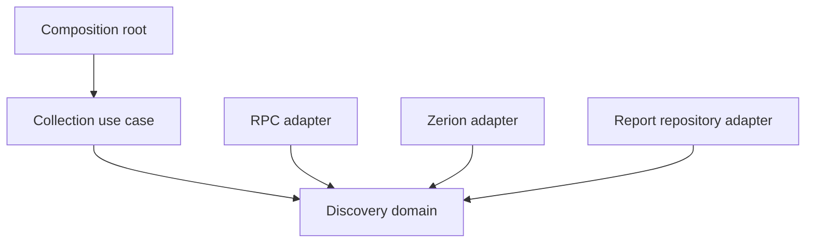

# Architecture

The initial bounded context is **portfolio discovery**: finding and preserving candidates while making coverage gaps explicit. Candidate discovery is deliberately separate from the future valuation, credit-risk and income contexts.

| Layer | Responsibility | Dependencies |
| --- | --- | --- |
| Domain | Wallet address value object, chain snapshots, candidates, report aggregate and completeness rules | Standard library |
| Application | Collect diagnostics, cancellation, partial results and checkpoints; define reader/discoverer/repository ports | Domain |
| Adapters | Translate RPC/Zerion responses, transport policy and plain/encrypted checkpoint persistence | Inner layers |
| Composition root | Parse private configuration and construct concrete implementations | All layers |

Ports belong to the application and are satisfied implicitly by Go interfaces. Provider JSON is translated at the boundary; provider DTOs do not enter application contracts. On-chain integers remain exact decimal strings after `math/big` decoding; there is no float-based financial calculation.

The report is a partial aggregate of independently checked sources. An empty, complete API response proves only that endpoint's response was exhausted. It cannot establish global asset/debt coverage. A missing key, timeout, unsupported source, rate limit or reorg is not a zero balance.

The RPC adapter records block number/hash/time and verifies the height after reads. This detects a reorg during collection; it is not finality verification. Future `eth_call` protocol adapters will require the same snapshot discipline.

The Zerion adapter caps requests and stops after access/auth/payment/rate failures. Next links must retain origin, endpoint and filters. Conservative rejection of provider links that omit filters needs live validation. A provider capability flag is not proof of every protocol's coverage.

No microservices, event bus, ORM, generic repository framework or speculative domain layers are introduced. Protocol-specific valuation/risk/income adapters follow only after real positions and their contract versions have been identified.

## Execution and privacy

The public workflow is an offline smoke check triggered by relevant code pushes, pull requests or manual dispatch. It proves build/test/runner availability, not RPC availability or a successful chat-to-portfolio round trip. Live results require a private transport; public Actions artifacts are not a private report store. Zero-spend requirements apply independently to runner minutes, storage and provider quotas.

## Encrypted report repository

`storage.AgeFile` implements the application's `ReportRepository` using the standard age file format and an X25519 public recipient. Only the infrastructure adapter imports `filippo.io/age`. JSON is streamed into encryption; no plaintext temporary report is written. The encrypted writer must close successfully before fsync, close and atomic rename publish the checkpoint. A failed write preserves the previous checkpoint.

The CLI validates the recipient before provider calls or output writes. It rejects configured collection in GitHub Actions when the recipient is absent. An unconfigured diagnostic may still produce a non-sensitive local JSON file in the smoke job. Plain JSON remains available for private local execution. An earlier plaintext file in a reused local output directory is not automatically deleted; remote runs must use a clean workspace and must never upload output directory globs.

The collector has no decryption identity. Keys must be retained privately by the report consumer before live collection starts. Encryption alone is not delivery, authenticity of the sender, or durable history: consumer validation must also bind an expected repository/run/commit and validate the report schema/freshness. A public recipient allows anyone to produce a decryptable age file. No remote artifact publication is enabled yet.
