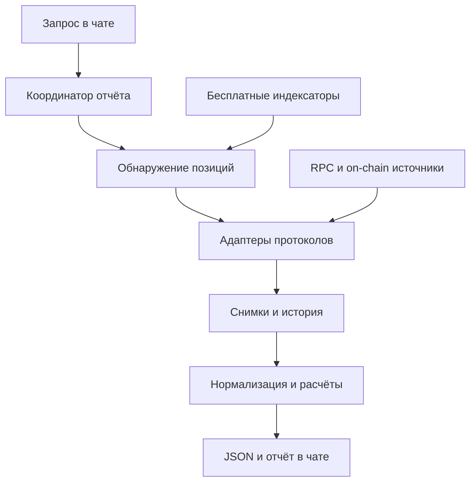

# Crypto Portfolio — Software Design Document

Версия 3.3 · 20 сентября 2026 · Go, DDD/Clean Architecture и журнал проверки осуществимости.

**Статус:** вычислительное ядро синтетически проверено, но главный риск продукта — доступность, полнота и проверяемость реальных данных — не снят. Разработка новых provider-neutral метрик приостановлена до проверки data plane. Public Actions остаются только синтетическими; live-сбор не выполнялся, реальных данных кошельков нет. Актуальная стратегия — §12; первый D0 результат — §14.27, безопасная граница authenticated D1 — §14.28, локальный authenticated результат — §14.29. Это не готовый отчёт о портфеле.

## 1. Задача

По явному запросу пользователя в ChatGPT собрать актуальное состояние единого портфеля из двух кошельков, вычислить показатели детерминированным кодом и вернуть понятный отчёт максимум за 10 минут. При недоступности части данных вернуть доступную часть с точным описанием пробелов.

Кошельки (публичные обозначения; адреса задаются приватно через `WALLETS_JSON`):

- `WALLET_1`
- `WALLET_2`

Все позиции обоих адресов входят в один портфель. По словам пользователя, каждая текущая кредитная позиция имеет один залоговый актив. Фактическая инвентаризация ещё не выполнена.

## 2. Согласованные требования и границы

| ID | Требование |
| --- | --- |
| R01 | Сумма активов в USD до вычета долга |
| R02 | Сумма долга в USD и долг как процент от активов |
| R03 | Доли инструментов от активов; долг не вычитается из знаменателя |
| R04 | Инструмент — отдельный вид токена или DeFi-позиция; разные виды токенов не склеиваются |
| R05 | Свободный токен и такой же токен в залоге объединяются в распределении |
| R06 | LP — самостоятельная позиция; её содержимое не распределяется между токенами в итоговой таблице |
| R07 | HF каждой кредитной позиции; HF < 1,4 — красная зона |
| R08 | Процент падения единственного залогового актива до HF 1,0 |
| R09 | Для LP: заработанные комиссии за последние 24 часа |
| R10 | Доходность за последние 7 суток в годовых только для LP, vault и иных доходных размещений стейблов |
| R11 | LP-доход включает комиссии и rewards с отдельными компонентами; vault-доход — доход доли и rewards; учитывать несобранный доход |
| R12 | Рыночное изменение цены активов и расходы на заём не входят в показатель доходности; внесения/выводы основной суммы не являются доходом |
| R13 | Расстояние в процентах от текущей цены до нижней и верхней границы LP; вне диапазона — направление и расстояние для возврата |
| R14 | Строго нулевой денежный бюджет. Бесплатные API-ключи и однократная настройка внешнего бесплатного исполнителя допустимы |
| R15 | Приоритет прямому чтению блокчейна через RPC или on-chain провайдеров |
| R16 | Запуск только по запросу, результат здесь в чате, ожидание до 10 минут |
| R17 | Если бесплатной истории недостаточно, явно показывать отсутствие истории и доступный период |
| R18 | При сбое — частичный отчёт; явно сообщать, какие данные по каким позициям не получены |

Не входят в первую версию: утреннее расписание, непрерывный мониторинг, уведомления о пересечениях, сделки, ребалансировка, управление залогом, налоговый учёт, совокупный инвестиционный P&L и интерфейс отдельного приложения. Расписание рассматривается позднее; сейчас задачи не создаются.

## 3. Предлагаемое решение

Один небольшой сервис со сменными адаптерами протоколов. Обнаружение позиций, чтение контрактов, расчёты и представление разделены. LLM запускает сбор и объясняет результат; балансы, HF, проценты и доходность считает код.

**Выбранная реализация по указанию пользователя:** Go последней стабильной версии (на 20.09.2026 подтверждена Go 1.27.1), DDD и Clean Architecture. Целочисленные on-chain значения и `math/big` для точных расчётов; финансовые вычисления через float64 запрещены. Один исполняемый бинарник, без микросервисов и брокера сообщений. Базовое хранилище — SQLite на долговечном диске; если бесплатный исполнитель эфемерен, обязательны загрузка и сохранение снимка базы в долговечное приватное хранилище. Последний вариант допустим только после проверки атомарности записи и восстановления. Конкретный хостинг, библиотеки и транспорт подключения выбираются на этапе 0; платного резервного пути нет.

### 3.1 Модули

| Модуль | Ответственность |
| --- | --- |
| ReportCoordinator | Один сбор на портфель, дедлайн, лимиты, статусы, отмена зависших операций |
| Discovery | Найти кандидатов по двум адресам, сверить с реестром прошлых позиций |
| ChainReader | RPC, проверка chain ID, фиксированный блок, повторы, бесплатный резервный endpoint |
| ProtocolAdapter | Состояние и история конкретного протокола, единицы риска и дохода |
| PriceResolver | USD-цены для отчёта; отдельные протокольные oracle-цены для риска |
| Normalizer | Идентичность инструментов, исключение двойного учёта, принадлежность пользователю |
| Metrics | Активы, долг, доли, ликвидация, границы LP, комиссии, APR |
| SnapshotStore | Реестр позиций, снимки, события, источники и ошибки |
| Renderer | Строгое отображение расчётного JSON в таблицы и пояснения |

Контракт адаптера: `discover(wallets, chain, cursor)`, `read_state(position_ids, block)`, `read_events(position_ids, from_block, to_block)`, `capabilities()`. Поддержка текущего состояния, исторического состояния, начислений и риска объявляется раздельно. Отсутствующая возможность возвращает структурированную причину, не пустой успешный результат.

## 4. Источники и обнаружение позиций

### 4.1 Прямое чтение и индексаторы

Стандартный RPC читает native balance, известные контракты и события, но не предлагает универсальный перечень всех DeFi-позиций адреса во всех сетях. Поэтому discovery использует бесплатный индексатор, реестр известных контрактов и события; авторитетное состояние известных позиций предпочтительно читается из контрактов. Это архитектурный вывод из набора [Ethereum JSON-RPC методов](https://ethereum.org/developers/docs/apis/json-rpc/).

Кандидат для discovery — бесплатный Zerion API. Его использование не обязательно и зависит от проверки текущих бесплатных условий и фактического покрытия. Не считать поддержанную агрегатором сеть доказательством поддержки всех её протоколов. [Официальные условия Zerion](https://zerion.io/api/).

Каждый запуск проверяет новые кандидаты и ранее известные позиции. Новый протокол без адаптера показывается как пробел покрытия. Исчезновение позиции из ответа индексатора само по себе не доказывает закрытие: нужны подтверждение состояния или событие. Реестр сетей и адаптеров версионируется. Система не заявляет «полное покрытие всех блокчейнов».

### 4.2 Матрица покрытия

После первого успешного discovery заполнить таблицу:

| Сеть / chain ID | Протокол и версия | Вид позиции | Discovery | Текущее состояние | HF/ликвидация | Доход 24ч/7д | Статус проверки |
| --- | --- | --- | --- | --- | --- | --- | --- |
| Пока не установлены | Пока не установлены | Пока не установлены | Не подтверждено | Не подтверждено | Не подтверждено | Не подтверждено | Этап 0 |

Ни Aave, ни Fluid, ни Uniswap, ни другая система не объявляются фактической позицией пользователя до получения данных. Отдельно учитывать staking/gauge, vault-обёртки, NFT LP и контрактные кошельки: фактический владелец NFT может быть staking-контрактом, а выгодоприобретатель — пользователем.

### 4.3 Проверенное ограничение среды

20 сентября 2026 года запросы `eth_getBalance` первого адреса к `mainnet.base.org` и `ethereum-rpc.publicnode.com` вернули HTTP 403; диагностический `eth_chainId` к Base также вернул 403 с `error code: 1010`. JSON-RPC результат не получен. Нельзя определить, вызван ли отказ инфраструктурой среды или защитой внешнего сервиса. Балансы и присутствие в этих сетях не установлены. Проверка публичных страниц также не дала пригодного перечня позиций.

Это ограничение текущего доступа, не доказательство невозможности бесплатного RPC в другом разрешённом исполнителе. Обход ограничений не предусматривается.

### 4.4 История и цены

Историческое чтение контракта требует доступного состояния соответствующего блока. Наличие истории логов не гарантирует доступ к старому `eth_call`; глубина бесплатного доступа проверяется отдельно. [Архивные узлы Ethereum](https://ethereum.org/developers/docs/nodes-and-clients/archive-nodes/).

Для стоимости портфеля: ликвидная рыночная USD-цена, а для неликвидного vault/RWA — доказуемая стоимость погашения или опубликованный NAV с датой и типом оценки. NAV не выдаётся за гарантированную цену немедленной продажи. Не использовать цену случайного малоликвидного пула как надёжную оценку. Стейблы не приравниваются автоматически к $1.

Для HF и ликвидации используются цены и параметры именно кредитного протокола. Рыночная цена отчёта может отличаться; источник цены показывается в деталях. Если источники расходятся, сохранять обе оценки с происхождением, не усреднять без правила.

## 5. Модель данных

| Сущность | Основные поля |
| --- | --- |
| Portfolio | id, wallets, config_version |
| Asset | chain_id, contract_address/native, decimals, symbol, verified_asset_mapping |
| Position | id, wallet, chain_id, protocol_version, type, contract, market_id, token_id/subaccount, status |
| PositionSnapshot | position_id, report_id, block_number/hash/time, quantities, value_usd, price_source, quality |
| DebtRisk | risk_unit_id, collateral_asset/quantity, debts[], oracle_prices, native_hf, derived_hf, liquidation_parameters |
| LPState | position_id, pool, base/quote, lower/upper_tick, current_tick, price, liquidity, fee_claims, rewards |
| IncomeEvent | position_id, tx_hash, log_index, block_hash, kind, asset, amount, event_time |
| Valuation | asset/position_id, price_usd, timestamp, source, kind: market/redeemable/NAV |
| Metric | name, value/null, unit, window, method_version, status, reason, evidence_refs |
| Report | id, started_at, completed_at, status, totals, tables, coverage, failures, snapshot_refs |

Количество токенов хранится без потери точности. Не определять идентичность по ticker: разные контракты могут иметь одинаковый символ. Объединение одного и того же вида между сетями допускается только через проверенную карту идентичности; мостовые варианты с различными правами погашения остаются отдельными. ETH/WETH/wstETH и BTC/cbBTC — отдельные виды.

Идентификатор кредитного риска соответствует единице ликвидации протокола: кошельку в рынке, vault-ID или subaccount. Риски двух независимых позиций никогда не усредняются. Сопоставление токенов для распределения не меняет единиц кредитного риска.

## 6. Правила учёта

### 6.1 Активы и долг

Обозначения: `A` — USD-стоимость всех активов без вычета долга и без двойного учёта; `D` — USD-стоимость обязательств; `V_i` — стоимость инструмента.

- Доля инструмента: `100 × V_i / A`.
- Доля долга: `100 × D / A`.
- Дополнительно можно показать собственный капитал `A − D` как справочный итог; он не используется в долях.
- При `A = 0` проценты не определены.
- Заёмные токены в кошельке входят в активы; соответствующее обязательство отдельно входит в долг.

Пример: активы $150 000, долг $50 000, инструмент $30 000 → доля инструмента 20%, долг 33,33% от активов.

Свободный токен и такой же залог суммируются в строку токена. Процентная позиция vault отображается самостоятельной строкой. Receipt-токен не прибавляется повторно к оценке представленного им депозита. LP оценивается целиком: внутренние количества можно читать для расчёта стоимости, но не выводить их как дополнительные активы портфеля. LP-vault и вложенный в него LP также не удваиваются.

Несобранные комиссии/rewards, если они достоверно принадлежат пользователю и имеют оценку, включаются в стоимость соответствующей позиции только один раз. После claim они переходят в свободный токен; это не новый доход. Внутренние переводы между двумя кошельками не являются внешним притоком и не создают дохода.

### 6.2 HF и запас до ликвидации

Требуемый сценарий: падение цены единственного залогового актива до HF 1,0. Сценарная предпосылка: количества, параметры протокола и USD-цены иных долговых активов фиксированы на момент снимка. Она подписывается в отчёте; это запас по цене, не прогноз времени до ликвидации.

Для линейной модели `HF = Q × P × LT / D`, где Q — количество залога, P — его oracle-цена, LT — действующий порог ликвидации:

- `P_liq = D / (Q × LT)`;
- `drop_pct = 100 × (1 − P_liq / P) = 100 × (1 − 1/HF)` при `HF > 1`.

Например, HF 2,0 → падение 50%; HF 1,25 → падение 20%, позиция уже красная. Порог HF 1,4 не используется как точка ликвидации. При HF ≤ 1 показывать «порог достигнут/пройден», а не отрицательный запас. Без долга — «нет долга», а не искусственно огромный HF.

Формула HF соответствует, например, [описанию Aave](https://aave.com/help/borrowing/liquidations), но не переносится автоматически на любой протокол. Адаптер использует реальные liquidation parameters, oracle и режим позиции. Если HF в протоколе нет, производный коэффициент разрешён только при доказуемой эквивалентности границе ликвидации и помечается «расчётный». Иначе показывается родная метрика риска и отсутствие сопоставимого HF.

Особый случай: актив долга совпадает с залогом или прямо зависит от его oracle-цены. Одна и та же цена не может одновременно падать в залоге и оставаться постоянной в долге. Адаптер пересчитывает связанные ноги и решает границу протокола; если падение не приводит к HF 1 или модель не поддержана — сообщает это. Для нелинейных моделей используется протокольная функция риска и поиск границы, а не приближение по формуле выше.

### 6.3 Диапазон LP

Для положительных цен в явно указанной котировке: текущая P, нижняя L, верхняя U.

- В диапазоне: падение до нижней `100 × (P − L)/P`; рост до верхней `100 × (U − P)/P`.
- Ниже диапазона: рост для возврата `100 × (L/P − 1)`.
- Выше диапазона: падение для возврата `100 × (1 − U/P)`.

Пример: P=$2 000, L=$1 600, U=$2 600 → до нижней −20%, до верхней +30%. Для нестейбловой пары котировка задаётся одним токеном в другом. При инверсии котировки границы инвертируются и меняются местами.

Принадлежность диапазону определяется точной семантикой ticks протокола, не округлённой ценой. Граница с отображением 0% может означать уже неактивную позицию. У full-range/обычного AMM нет искусственных пользовательских границ: показать «не применимо». Для автоперестраиваемого vault показывать доступную текущую политику/состояние, не выдумывать постоянный диапазон.

### 6.4 Комиссии, rewards и APR

Окна: последние 24 часа и последние 7 × 24 часа относительно времени отчёта; время хранится в UTC. Если конец истории отстаёт, показывать фактические даты окна и его статус.

Для LP считать заработанные комиссии, а не сумму claim и не текущее значение unclaimed. Базовое тождество «claim за период + unclaimed в конце − unclaimed в начале» допустимо только если адаптер учёл изменения ликвидности, transfers, reinvest и особенности протокола. Вывод основной суммы не считается комиссией. Предпочтительно восстановление начислений по fee-growth и событиям; каждый адаптер обязан иметь проверку сохранения дохода при claim/compound.

Vault: выделять доход доли через exchange rate/accounting протокола, сегментируя период при внесениях и выводах. Рост рыночной цены базового актива исключается. Встроенный в exchange rate доход от reinvest/rewards не прибавляется вторично отдельной наградой. Используется доход после встроенных комиссий протокола, до расходов пользователя на долг и gas; такая база явно подписывается.

Техническое соглашение оценки: начисления вести в исходных токенах; для USD-показателя окна оценивать их по цене конца этого окна. Это исключает переоценку ранее накопленных комиссий из заработка, но не является кассовым денежным потоком. Метод указывается в отчёте. Если протокол не позволяет отделить доход от ценового P&L, показатель не вычисляется.

`APR_7d = income_7d_USD / average_position_value_7d_USD × 365/7 × 100%`.

Средняя стоимость — усреднённая по времени стоимость позиции: `Σ(V_j × Δt_j) / 7 дней`, с точками на изменениях капитала и регулярной сеткой цен/оценок, если доступна история. Интерполяция между наблюдениями помечается как оценка; при существенных пропусках показатель отсутствует. Это доходная ставка относительно средней стоимости, не total-return TWR/IRR и не прогноз будущего дохода.

Отдельные колонки: fees_24h, fees_7d, rewards_7d, vault_income_7d, APR без rewards и APR с rewards — где применимо. Если позиции меньше 7 дней или история неполная, показывать доступный доход за фактический период; не называть его APR₇. Текущий advertised APR не используется вместо измерения. Нулевая средняя стоимость, неизвестная цена или неполный набор денежных событий делают APR недоступным.

## 7. Сбор, время и согласованность

1. Создать report_id, абсолютный дедлайн 600 секунд; проверить конфигурацию и доступные бесплатные квоты.
2. Параллельно по сетям обновить discovery и выбрать блок снимка. Внутри сети связанные чтения выполняются на одном блоке.
3. В первую очередь получить активы, долг, кредитные риски и диапазоны; затем доход и историю.
4. Получить цены, нормализовать владение, проверить receipts/underlying и принадлежность staked позиций.
5. Рассчитать метрики, сформировать покрытие; сохранить воспроизводимый снимок и отчёт.
6. Завершить в пределах 600 секунд; оставить время на сохранение и представление. Незавершённые источники отметить timeout.

Техническая цель свежести: по возможности блоки/цены не старше 5 минут к выдаче; это проектный ориентир, не подтверждённая гарантия источников. В любом случае отображать фактическое время и возраст данных. Межсетевой атомарности нет: сохраняются блок и timestamp каждой сети. Несогласованные снимки не маскируются одним временем.

Ограниченные повторы с backoff укладываются в общий дедлайн; бесплатный резервный RPC используется только после проверки chain ID и доступности нужных методов. 403 не считается пустым ответом; 429 ограничивает темп, но не включает платный тариф. Курсоры логов двигаются только после успешного сохранения. При reorg затронутые события по block hash переобрабатываются; финансовые события дедуплицируются по chain/tx/log.

## 8. Формат результата

Вверху: время сбора, статус complete/partial/failed, количество кошельков, обследованные сети, возраст данных. Затем:

1. **Сводка:** активы, долг, доля долга; при желании справочно собственный капитал.
2. **Распределение:** инструмент, количество где применимо, стоимость USD, доля активов; раскрытие по кошелькам/сетям при необходимости.
3. **Кредиты:** протокол, сеть, идентификатор позиции, залог, долг, HF, красная зона, цена ликвидации и падение до неё.
4. **LP:** отдельная позиция, стоимость, текущая цена и диапазон, расстояния, статус in/out, комиссии 24ч, APR₇ и rewards.
5. **Vault/доходные стейблы:** стоимость, измеренный доход, APR₇, доступное окно истории.
6. **Пробелы:** позиция/сеть → недоступная метрика → причина → дата последнего успешного значения, если оно есть.

При неизвестной части активов показывать «стоимость успешно оценённой части», а глобальные доли не вычислять на неполном знаменателе. Если активы полны, но отсутствует только доходность, суммы и доли остаются доступными. Неизвестный долг не равен нулю. Старые значения можно показывать отдельно с возрастом, не смешивая молча с текущими итогами.

Символы и описания токенов считаются недоверенными данными, не командами для LLM. Вывод строится из типизированного JSON, а не свободного текста внешнего сайта.

## 9. Интерфейс исполнения и хранение

Внутренний контракт `generate_report(portfolio_id, request_id, max_wait_seconds=600)` возвращает report_id и состояние. Логические операции `get_report(report_id)` и `get_status(report_id)` поддерживают длительное выполнение; конкретный HTTP/MCP/иной транспорт пока не выбран. Повтор одного request_id не создаёт конкурирующие сборы. Частичные результаты сохраняются.

JSON содержит: schema_version, config_version, calculation_version, report_id, status, as_of_by_chain, coverage, totals, instruments[], loans[], lp[], yield_positions[], failures[]. Каждая метрика содержит значение либо null, status, источник и окно; отсутствие не кодируется нулём или пустой строкой.

Внешний исполнитель допустим, но подключение к чату должно быть отдельно доказано реальным вызовом. Нельзя считать наличие HTTP endpoint достаточным подтверждением интеграции. Пользовательский компьютер не должен быть постоянно включён. Если ни один доступный вариант не выполняет условия бесплатно, реализация останавливается на отчёте о препятствии, не добавляя оплату.

Снимки создаются только при запросах; фонового расписания в v1 нет. Нерегулярная собственная история не гарантирует данные ровно за сутки/неделю. Предлагаемая политика хранения: компактные нормализованные снимки и расчётные входы минимум 90 дней, отчёты и изменения конфигурации — пока не исчерпан бесплатный бюджет хранения; лимит проверяется до записи, удаление не происходит молча. Требуемую политику очистки определить при выборе хранилища.

Ключи провайдеров хранятся в секретах исполнителя, не в SDD, коде и отчётах. Не нужны private keys, seed, разрешения на токены или подписи. API исполнителя приватен и аутентифицирован. Прямое чтение контрактов не отправляет транзакции. Кошельки передаются только используемым источникам данных; нового публичного профиля портфеля система не создаёт.

## 10. Качество данных и ошибки

Статусы метрик: `ok`, `estimated`, `stale`, `insufficient_history`, `unsupported`, `unpriced`, `error`, `not_applicable`.

Отдельные ошибки: RPC_ACCESS_DENIED, RATE_LIMITED, TIMEOUT, UNSUPPORTED_PROTOCOL, DISCOVERY_INCOMPLETE, ARCHIVE_UNAVAILABLE, MISSING_PRICE, INCONSISTENT_SNAPSHOT, INVALID_RISK_MODEL. Для каждой сохраняются scope, provider, metric, retryable и человекочитаемое пояснение.

«Complete» означает полноту внутри проверенной матрицы покрытия, не доказательство отсутствия неизвестных сетей. Пока исходная инвентаризация не сверена, discovery_complete=false. Спам/непроверенные токены не получают произвольную долларовую оценку и не увеличивают итоги; они могут появляться в разделе неоценённых кандидатов.

## 11. Проверки и критерии приёмки

| ID | Проверка | Ожидаемый результат |
| --- | --- | --- |
| A01 | Один токен на обоих кошельках, часть в залоге | Одна строка распределения, правильная сумма; отдельные кредитные риски |
| A02 | ETH, WETH и wstETH | Три разных вида, без объединения по экспозиции |
| A03 | Receipt, underlying, вложенный vault/LP | Никакого двойного учёта |
| A04 | Активы 150k, долг 50k, инструмент 30k | 20% инструмента; 33,33% долга |
| A05 | Линейная модель, HF=2; HF=1,25 | Падение 50%; 20%, вторая позиция красная |
| A06 | HF=1,4; HF≤1; долг=0 | Не красная по строгому правилу <1,4; порог достигнут; «нет долга» |
| A07 | Цена 2000, диапазон 1600–2600 | Нижняя −20%, верхняя +30%; корректная инверсия котировки |
| A08 | LP выходит из диапазона | Статус out и процент возврата, без ошибочного статуса по округлению |
| A09 | Claim/reinvest и вывод основной суммы | Доход не удваивается, principal не становится комиссией |
| A10 | Новый депозит или перевод между кошельками | Не появляется ложный доход; средний капитал обновляется |
| A11 | Нет недельной истории | APR₇ отсутствует, доступное окно подписано |
| A12 | Сбой одной сети или цены | Частичный отчёт, точные пробелы; нет ложных полных долей |
| A13 | Сбой только доходности | Текущие активы и риски сохраняются доступными |
| A14 | Зависший источник | Результат/сообщение о полном сбое в пределах 600 секунд |
| A15 | Повтор запроса, рестарт, reorg | Нет двойных событий и повреждения истории |
| A16 | Бесплатная квота исчерпана | Частичный результат, ни одного платного перехода |

Математические и учётные тесты выполняются на фиксированных примерах. Контрактные адаптеры сверяются на одном и том же блоке с прямыми вызовами/официальным интерфейсом; допуск задаётся исходной точностью протокола, а не произвольным процентом. Затем нужен end-to-end тест обоих реальных адресов и реального вызова из чата. Пока он не пройден, система не считается готовой.

## 12. План реализации и условия перехода

Стратегия изменена на **data-first**. Главная неопределённость — не формулы, а возможность бесплатно, воспроизводимо и приватно получить достаточно полные данные. Поэтому новые универсальные модели LP/vault/income и рефакторинг ядра заморожены, пока data plane не пройдёт контрольные точки ниже. Код пишется только тогда, когда он непосредственно проверяет гипотезу об источнике, покрытии или доставке.

**Шаг D0 — быстрый отбор источников без данных кошельков.** Для каждого кандидата проверить из целевой среды: доступность DNS/TLS/HTTP, chain identity для RPC, актуальные условия бесплатного тарифа, hard limit без overage, необходимые методы, пагинацию и заявленное покрытие DeFi. Секреты и адреса не используются. Выход: короткая таблица `пригоден / отклонён / требует ключ`, дата проверки и доказанная причина. Timebox — один инженерный цикл; источник отклоняется при сетевом запрете, обязательной оплате либо отсутствии нужных методов.

**Шаг D1 — контракт источника.** Для оставшихся кандидатов проверить реальные схемы ответов на официальных примерах или искусственных запросах: стабильные идентификаторы chain/protocol/position, точные quantities, pagination, rate-limit/error semantics и возможность привязать состояние к блоку. Ответ провайдера не считается доказательством полноты. Выход: сохранённые только синтетические fixtures и автоматические contract tests; никакие пользовательские данные в репозиторий не попадают.

**Шаг D2 — минимальный приватный discovery.** Только после D0–D1 настроить один выбранный бесплатный источник и выполнить однократный on-demand сбор `WALLET_1` и `WALLET_2` через уже доступный пользователю приватный ввод и приватный возврат результата. Если такого канала нет, это явный внешний блокер, а не повод продолжать строить метрики. Первый запуск собирает только inventory, provenance, страницы, snapshots и failures; оценка/HF/APR не являются условием запуска.

**Шаг D3 — проверка качества данных.** Повторить discovery минимум дважды, исчерпать разрешённую пагинацию либо явно отметить её предел, сверить выборочные позиции с независимым on-chain чтением на тех же блоках и заполнить матрицу §4.2. Проверяются пропуски сетей, wrapper/staking/LP ownership, исчезнувшие позиции и конфликтующие quantities. Выход: измеренное покрытие и перечень конкретных протоколов; слова «полный портфель» запрещены, пока полнота не доказана.

**Шаг D4 — вертикальный срез одного фактического протокола.** Выбрать наиболее значимую обнаруженную позицию и довести её от discovery до подтверждённого состояния и одной нужной метрики. Только после успешного среза добавлять следующие protocol adapters. Общие LP/vault/income abstractions создаются из фактических контрактов данных, а не заранее.

**Этап 1 — текущий портфель по подтверждённому покрытию.** Расширить вертикальные срезы на обнаруженные протоколы, затем включить уже реализованные точные valuation, aggregation и debt-risk/HF модели. Выход: первый частичный фактический отчёт с provenance и маркировкой недоступного.

**Этап 2 — история и доход только после проверки глубины данных.** Сначала доказать доступность старых блоков/событий и восстановимость principal/claims/reinvest, затем реализовать fees/rewards/APR только для прошедших проверку протоколов.

**Этап 3 — устойчивость и завершение v1.** Дедлайн, retries, восстановление состояния, новая позиция, partial reports, тест нулевых расходов и end-to-end из чата. Выход: работающий сценарий по запросу в пределах измеренного покрытия.

**Порядок ближайших действий:** D0 → D1 → при необходимости одна конкретная просьба пользователю для приватной настройки → D2 → D3 → один вертикальный срез D4. До результата D3 работа над LP/vault range metrics, APR и дополнительной универсальной арифметикой не является приоритетом.

## 13. Решения и оставшиеся технические проверки

| Решение | Основание |
| --- | --- |
| Data-first; код следует за доказанными данными | Главный незакрытый риск — доступность и покрытие источников, а не универсальная арифметика |
| RPC-first, индексатор вспомогателен | Предпочтение пользователя; необходимость обнаружения до чтения |
| Один портфель, два кошелька | Ответы Q4/Q7 |
| Gross assets как знаменатель | Q9 |
| Виды токенов раздельно; LP целиком | Q8/Q13 |
| HF<1,4 красный, падение до HF1,0 | Q10/Q14/Q18 |
| Доходные метрики без рыночного P&L и займа | Q11/Q15 |
| Исторические пробелы допустимы | Q16 |
| Частичный отчёт предпочтительнее полного отказа | Q17 |
| До 10 минут, внешний бесплатный исполнитель допустим | Q20/Q21 |

Неопределённости реализации: реальные сети и протоколы; бесплатное RPC/архивное покрытие; доступный транспорт вызова из чата; провайдер долговечного хранения; конкретные adapters и особенности oracle. Они не требуют придумывать новые пользовательские цели: их нужно разрешить техническими проверками этапа 0. Предложения о Python, хранении и цели свежести являются инженерным вариантом этого SDD, а не уже развёрнутой инфраструктурой.

Интервью проведено по [grilling Мэтта Покока](https://github.com/mattpocock/skills/blob/main/skills/productivity/grilling/SKILL.md). На этапе подготовки v1.0 реализация и внешние аккаунты не создавались. При проверке v1.1 создан локальный диагностический пакет; GitHub подключён пользователем, репозиторий и внешний запуск не выполнены. Расписания не создавались.

## 14. Журнал проверки осуществимости — 20.09.2026

### 14.1 Результат этапа 0

**PARTIAL / BLOCKED.** Документация, локальное исполнение и сохранение артефактов доступны. Успешного чтения блокчейна или списка позиций нет. Нулевые балансы не установлены. Реальные активы, долг, HF, LP-диапазоны и доходность не вычислялись.

Пакет `Crypto-Portfolio-Stage0.zip` содержит read-only диагностику, manual GitHub Actions workflow, пять offline-тестов и исходный JSON проверки текущей среды. Он подготовлен для размещения в приватном репозитории, но не развёрнут. Его состояние не надо путать с готовностью production-сборщика.

### 14.2 Реальные сетевые проверки

Время фиксации: 2026-09-20 10:02:38 UTC. Запросы выполнялись из текущего shell runtime; исходный JSON сохранён в пакете как `evidence/current-environment-probes.json`. Для RPC проверялась идентичность сети до запросов кошелька.

| ID | Источник / запрос | Фактический результат | Вывод |
| --- | --- | --- | --- |
| P01 | Base Blockscout, GET `/api/v2/addresses/<первый адрес>` | HTTP 403, Cloudflare 1010, browser_signature_banned | Нет ответа о кошельке |
| P02 | Ethereum Blockscout, аналогичный GET | HTTP 403, Cloudflare 1010 | Нет ответа о кошельке |
| P03 | Zerion API, GET `/v1/chains/` без ключа | HTTP 403, Cloudflare 1010 | Отказ до проверки пригодности API; не подтверждает валидность/невалидность ключа |
| P04 | Base `mainnet.base.org`, POST `eth_chainId` | HTTP 403, Cloudflare 1010 | Не получен даже chain ID |
| P05 | Ethereum `eth.llamarpc.com`, POST `eth_chainId` | Read timeout, около 23 секунд вместе с установлением соединения | Доступ не подтверждён; постоянная блокировка не доказана |
| P06 | Web-чтение Base Blockscout API | URL inaccessible | Web не дал альтернативного ответа |

Структурированный ответ P01–P04 обозначает `access_denied`, `retryable=false`, `owner_action_required=true` и отказ по сигнатуре клиента. Это уточняет прежнюю запись §4.3: теперь есть явная категория ответа. Не менять User-Agent, не подключать обходные прокси и не повторять этот отказ. Проверка второго кошелька на тех же отказавших источниках не выполнена, поскольку проблема обнаружена раньше получения данных адреса. Полнота обоих кошельков остаётся неизвестной.

### 14.3 Что получилось

| Проверка | Статус | Что именно доказано |
| --- | --- | --- |
| Локальное исполнение Python | PASS | Код выполняется в текущем runtime |
| Классификация HTTP 403 | PASS, offline test | Отказ не превращается в пустой портфель |
| HTTP 200 с JSON-RPC error | PASS, offline test | Ошибка API не считается успешными данными |
| Несовпадение chain ID | PASS, offline test | Запросы балансов после него не выполняются |
| Отсутствие конфигурации/ключа | PASS, offline test | Честный missing_api_key, без сетевых вызовов |
| Наличие следующей страницы discovery | PASS, offline test | Выдача не помечается полной |
| Сохранение SDD и диагностических материалов | PASS | Сохранены отдельные файлы с воспроизводимыми результатами |
| Обнаружение готовых DeFi-плагинов | NOT FOUND | Поиск Zerion/DeFi/blockchain/RPC не вернул подходящих подключений; это результат поиска, не утверждение об отсутствии в мире |
| Подключение GitHub | CONNECTED | Подключение подтверждено приложением и повторным поиском: installed=true |
| GitHub read-only API | PASS | После обновления контекста get_user_login успешно вернул DanilaKorobkov; list_repositories(owner=DanilaKorobkov) успешно вернул пустой видимый список |
| GitHub создание repo / первый workflow dispatch | BLOCKED | Эти операции не представлены в доступном каталоге плагина; gh отсутствует. Чтение Actions logs/artifacts представлено, но на реальном запуске ещё не проверено |
| Реальный внешний workflow | NOT RUN | Репозиторий не создан, workflow не загружен, артефакт Actions не получен |
| Discovery обоих кошельков | NOT VERIFIED | Нет достоверного списка сетей/позиций |
| История, HF и LP fees | NOT TESTED | Нельзя проверять контрактные расчёты без подтверждённых позиций и доступного чтения |

Локальные тесты используют явно искусственные fixtures, не данные кошельков. Они доказывают обработку ошибок, но не покрытие протоколов, доступность бесплатного RPC или корректность будущих финансовых адаптеров.

### 14.4 Проверенные условия источников и внешнего исполнения

**Zerion.** На [официальной странице API](https://zerion.io/api/) указан Developer за $0, 2 000 запросов/день, 3 RPS. Для DeFi Positions, Portfolio Chart и P&L указано ограничение 25% квоты; точный совместный учёт надо подтвердить при подключении. Бесплатный ключ допустим пользователем, но в текущем runtime `ZERION_API_KEY` не задан. Аналогично не заданы стандартные переменные ALCHEMY_API_KEY, INFURA_API_KEY и ETHERSCAN_API_KEY; это не означает, что пользователь не имеет таких ключей вне этой среды.

Критическое правило discovery: по [документации positions](https://developers.zerion.io/api-reference/wallets/get-wallet-fungible-positions) default — `filter[positions]=only_simple`. Для простых активов и DeFi требуется `no_filter`. Использовать Basic authentication и проверять pagination. Пакет диагностики читает только первую страницу и явно сохраняет pagination_pending; полная пагинация относится к будущему production-адаптеру. Бесплатный ключ сам по себе не гарантирует устранение Cloudflare 1010.

**GitHub Actions — кандидат, не выбранная работающая инфраструктура.** [Официальные условия](https://docs.github.com/en/billing/concepts/product-billing/github-actions) указывают для GitHub Free 2 000 минут/месяц и 500 MB artifact storage. Эти лимиты относятся к аккаунту, а не выделены этому проекту. При отсутствии платёжного метода использование блокируется после исчерпания квоты; с платёжным методом необходимо отдельно подтвердить настройки ограничения расходов. До такой проверки запуск запрещён собственным требованием проекта о нулевом бюджете.

Пакет использует приватный репозиторий, standard Linux runner, job timeout 8 минут и только ручной `workflow_dispatch`; по [документации запуска](https://docs.github.com/en/actions/how-tos/manage-workflow-runs/manually-run-a-workflow) workflow должен находиться в default branch, а запуску требуется write-доступ. Наличие подключённого GitHub не доказывает наличие этих прав или поддержки dispatch через плагин.

GitHub job timeout не включает гарантию ожидания очереди. Поэтому 10 минут от команды в чате до финансового отчёта пока НЕ гарантируются. Координатор в чате должен отдельно отслеживать абсолютный дедлайн и возвращать состояние queued/timeout, если данные ещё не получены. Финальный критерий «получить данные за 10 минут» остаётся непроверенным.

Workflow сохраняет диагностический JSON 7 дней. Artifacts могут истечь; они не годятся как единственное долговечное хранилище исторических снимков при редких запросах. Постоянное приватное хранение и восстановление SQLite во внешнем исполнителе пока не проверены. [Документация artifacts](https://docs.github.com/en/actions/how-tos/manage-workflow-runs/download-workflow-artifacts).

**Собственный MCP — альтернатива.** Официальная [инструкция подключения](https://developers.openai.com/plugins/deploy/connect-chatgpt) требует доступный endpoint или предусмотренный tunnel, проверенные схемы инструментов и аутентификацию. Доступность developer mode зависит от аккаунта/политики. Ни MCP endpoint, ни его доступность пользователю пока не проверялись. Это документированная возможность, не готовое подключение. Платный OpenAI API не требуется архитектурой диагностического пакета и не подключался.

### 14.5 Реестр ограничений и дальнейшие действия

| ID | Ограничение | Влияние | Условие снятия |
| --- | --- | --- | --- |
| L01 | Cloudflare 1010 у проверенных data endpoints | Нет текущих данных здесь | Провайдер с разрешённым доступом; нормальная авторизация/доступ, без обхода отказов |
| L02 | Бесплатный ключ discovery не предоставлен исполнителю | Автоматическое discovery через Zerion не проверено | Настроить ключ через секреты выбранного исполнителя; не отправлять ключ в текст чата |
| L03 | GitHub чтение работает, но нет create_repository/workflow_dispatch; видимых repo нет | Нельзя самостоятельно разместить пакет в новом repo и впервые запустить его | Доступный приватный repo и разрешённый способ записи/первого запуска; чтение аккаунта уже подтверждено |
| L04 | Аккаунтные квоты и запрет overage не проверены | Нельзя обещать нулевую стоимость внешнего запуска | Проверить квоты и hard stop расходов до запуска |
| L05 | GitHub queue latency неизвестна | Полный отчёт за 10 минут не гарантируется | Реальный end-to-end тест; при необходимости другой бесплатный исполнитель |
| L06 | Сети и протоколы неизвестны | Нельзя выбрать конкретные контрактные адаптеры | Первый успешный discovery + сверка покрытия |
| L07 | Архивное состояние не проверено | Нет оснований обещать fees24h/APR7d | Проверка старых блоков/событий по реальным позициям; иначе N/A |
| L08 | Долговечное хранилище внешнего исполнителя не выбрано | Возможна потеря накопленной истории | Проверить приватное хранение и восстановление, не полагаться только на временные artifacts |

**Следующий конкретный шаг:** использовать уже подключённый GitHub. Аккаунт DanilaKorobkov успешно прочитан; доступных подключению репозиториев не найдено. Это не доказывает отсутствие репозиториев в аккаунте — возможны ограничения видимости. Нужно получить доступ к приватному репозиторию, проверить нулевой бюджет, разместить подготовленный пакет и настроить разрешённые источники через secrets. Первый workflow_dispatch требует отдельного доступного способа, поскольку такой операции плагин не предоставляет. Затем получить diagnostics.json и обновить матрицу §4.2. При access_denied фиксировать отказ без обхода. Повторно подключать GitHub не требуется.

Уточнение GitHub после первоначального сохранения v1.1: проверка в свежем контексте обнаружила новые операции плагина; ограничение первоначального root-каталога больше не трактуется как отсутствие подключения. Read-only вызовы выполнены успешно, mutations не выполнялись.

### 14.6 Минимальное внешнее действие для продолжения

Каталог GitHub содержит create/update_file, create_branch, create_blob/tree/commit, update_ref и создание PR для уже существующего репозитория. Общего API, передачи CLI-credentials, создания репозитория и workflow_dispatch в каталоге нет. Файлы можно будет разместить после проверки доступа; запись workflow-файлов пока не проверена.

Пользователю достаточно создать **приватный репозиторий с README**, предоставить уже подключённому GitHub-приложению доступ к нему и прислать ссылку. README создаёт начальный commit/default branch. После этого агент может проверить репозиторий и записать подготовленные файлы. Первый ручной запуск Actions и добавление secrets потребуют доступного UI/другого разрешённого механизма; сейчас агент не утверждает, что может выполнить их через имеющийся плагин. Подключение GitHub заново не требуется.

### 14.7 Продолжение в новой сессии — v1.2, 20.09.2026

**Состояние этапа 0 остаётся PARTIAL / BLOCKED.** Реальные данные кошельков не получены. Изменения ниже — проверенная доработка диагностики, а не переход к готовому отчёту.

#### Повторная проверка среды

- `get_user_login` снова вернул DanilaKorobkov. `list_repositories` без фильтра owner вернул пустой список; `list_installed_accounts` также вернул пустой список. Это не доказывает отсутствие repo в аккаунте, но не даёт доступной цели для размещения кода.
- Доступны операции записи файлов, веток и Git objects в существующий repo, чтение Actions logs/artifacts. Создания repo, первого `workflow_dispatch`, управления secrets и проверки billing в каталоге нет. Ограничение L03 не снято сменой сессии.
- Браузер доступен. Переход к созданию repo на GitHub открыл страницу входа. После безопасного ввода через browserAuth сайт перешёл к подтверждению в GitHub Mobile; успешная авторизованная сессия пока не подтверждена. Вход в GitHub-подключение и сессия браузера независимы. Repo, workflow, secrets и billing не менялись.
- `ZERION_API_KEY` и `RPC_CONFIG_JSON` в runtime не заданы. К прежним заблокированным data endpoints повторных обращений не было. Проверка v1.2 с явно пустой конфигурацией выполнилась без сети и честно вернула failed/missing configuration.

Доказательства сохранены в обновлённом пакете: `evidence/session-capabilities.json`, `evidence/current-session-unconfigured.json`. Прежний `current-environment-probes.json` сохранён без изменения как историческое свидетельство предыдущей сессии.

#### Доработки пакета

1. Добавлен `discovery.py`: чтение каталога Zerion `/v1/chains/` и явная фиксация `supports_positions` = true / false / unknown. Успех выдачи позиций не трактуется как полнота всех сетей и протоколов.
2. Добавлена ограниченная пагинация для обоих адресов: до 20 страниц на список и 60 запросов на запуск, интервал не менее 0,4 секунды. Дедупликация по provider resource ID; конфликтующие записи одного ID помечаются inconsistent. Лимит/цикл/ошибка сохраняет уже полученные данные и неполный статус.
3. Ссылки следующей страницы принимаются только для того же HTTPS host/path и исходных фильтров. Если провайдер опускает фильтры в next-ссылке, пакет останавливается, не конструируя курсор. Это консервативное поведение ещё нужно проверить на реальном API.
4. Запрашиваются и обычные, и DeFi-кандидаты (`filter[positions]=no_filter`), включая помеченные провайдером как trash (`filter[trash]=no_filter`). Кандидаты не считаются активами, цены не суммируются; нужны проверка spam, владения и двойного учёта.
5. После 401/402/403/429 дальнейшие обращения к Zerion прекращаются; пропущенные кошельки получают явную причину. Для RPC отказ останавливает дальнейшие вызовы того же host. HTTP 402 не включает платный механизм.
6. Частичные страницы записываются в diagnostic JSON через атомарную замену файла. Это локальный checkpoint, не проверенное долговечное хранилище истории.
7. Неправильная конфигурация, block number и native balance больше не маскируются успешным пустым результатом. Из provider errors не сохраняются сырые сообщения, способные отразить секретный URL.
8. JSON schema повышена до 2; `response_complete` относится только к конкретному API-списку. `portfolio_complete`/`discovery_complete` остаются false до инвентаризации и проверки адаптеров.

**Проверка:** 19 offline-тестов прошли, 0 ошибок. Проверены обработка отказов, сохранение частичных страниц, обе записи кошельков при остановке провайдера, цикл/лимит пагинации, смена scope, отсутствие передачи auth на посторонний URL, неоднозначное покрытие сетей, неправильные RPC-значения. Все fixtures искусственные; успешных live-проверок добавлено не было.

#### Новые ограничения и уточнения

| ID | Уточнение | Практический эффект |
| --- | --- | --- |
| L09 | Вход GitHub дошёл до подтверждения в GitHub Mobile | UI-создание repo и первый запуск требуют завершения 2FA и проверки авторизованной страницы |
| L10 | Успешный positions endpoint может молча исключать неподдержанные сети | Нужна сверка с каталогом и отдельными протокольными источниками; пустота не равна отсутствию активов |
| L11 | RPC-диагностика фиксирует номер блока, но пока не hash/time и reorg | Это техническая проба, не production-снимок |
| L12 | Дедлайн кода мягкий; таймауты транспорта и очередь Actions не проверены end-to-end | Гарантия 10 минут остаётся непроверенной |
| L13 | Локальные лимиты запросов не проверяют общий остаток бесплатной квоты | Бесплатный тариф и запрет overage проверяются у выбранного исполнителя/провайдера перед запуском |

Основания доработки: [Zerion positions](https://developers.zerion.io/api-reference/wallets/get-wallet-fungible-positions), [pagination](https://developers.zerion.io/pagination-and-filtering), [chains](https://developers.zerion.io/api-reference/chains/get-list-of-all-chains). Документация прочитана, сетевой доступ к самим API из этой среды не подтверждён.

**GitHub не является обязательной частью архитектуры.** Это кандидат бесплатного внешнего Python-исполнителя; репозиторий хранит код, Actions выполняет сбор. Диагностический пакет не зависит от GitHub API и может выполняться в ином разрешённом runtime. Любая замена всё равно требует доказать бесплатность, HTTPS-доступ, долговечное хранение и запуск из чата.

По отдельному поручению пользователя запущено исследование обычных способов получения криптоданных. Его выводы и подтверждённые ограничения будут добавлены после завершения; без получения реальных позиций матрица §4.2 не заполняется предположениями.

### 14.8 Переход на Go и публичный репозиторий — историческое состояние v1.3

**Новые явные решения пользователя:** создать публичный репозиторий; весь код писать на актуальном стабильном Go, по DDD и Clean Architecture. Они заменяют прежнее предложение Python и требование приватности исходного repo. Персональные данные, кошельки, SDD, API-ключи и сырые отчёты остаются приватными.

#### Что выполнено

- Создан [DanilaKorobkov/crypto-portfolio](https://github.com/DanilaKorobkov/crypto-portfolio), visibility=public, default branch=`develop`, начальный README commit. В браузере успешно завершён вход и подтверждено владение аккаунтом.
- Через веб-интерфейс опубликованы ровно четыре файла: `README.md`, `AGENTS.md`, `go.mod`, `.gitignore`. Это описание и настройки подготовленного Go-проекта, а не доказательство публикации исходников. Ветки/PR для других изменений не создавались.
- Актуальная стабильная версия Go **1.27.1** проверена по [официальному списку](https://go.dev/dl/?mode=json); toolchain скачан из официального источника и проверен по опубликованному SHA-256. Локальное исполнение Go работает.
- Go-код реализован в `crypto-portfolio/`: доменная модель discovery, сценарий сбора, порты провайдеров/репозитория, RPC/Zerion/HTTP/JSON адаптеры и CLI composition root. Сторонних Go-зависимостей нет.
- `gofmt` применён, `go vet ./...` завершился успешно, **24 теста** `go test -race -count=1 ./...` прошли. Fixtures искусственные; transport-тесты используют локальные HTTPS-серверы, не реальные data endpoints.
- RPC-адаптер проверяет chain ID, фиксирует номер/hash/time блока, читает native balances на том же номере, затем повторно проверяет hash этого height. При обнаруженном reorg значения не остаются успешными. Это устраняет прежний L11 для новой Go-версии, но не доказывает финальность блока или корректность конкретного контракта.
- Сохранены ограничения discovery из Python-прототипа: bounded pagination, проверка scope/URL, квота запросов, частичные результаты, явные capability flags, остановка после 401/402/403/429. Schema JSON новой версии — 3.
- Все исходники перед публикацией проверены на отсутствие двух реальных адресов и Library IDs. Адреса читаются из `WALLETS_JSON`, RPC — из `RPC_CONFIG_JSON`, Zerion key — из `ZERION_API_KEY`. В публичные логи CLI пишет только статус сохранения.

| Слой | Пакет | Граница ответственности |
| --- | --- | --- |
| Domain | `internal/domain` | Address value object, Candidate, ChainSnapshot, Report и правило неполноты |
| Application | `internal/application` | Collector и порты ChainReader, PositionDiscoverer, ReportRepository |
| Infrastructure | `internal/adapters/{rpc,zerion,transport,storage}` | Provider DTO mapping, HTTPS, протокольное чтение и приватные JSON checkpoints |
| Composition root | `cmd/portfolio` | Валидация приватной конфигурации, сборка адаптеров, context deadline |

Domain не импортирует адаптеры. Application зависит от домена и интерфейсов; внешние реализации подключаются в composition root. Контексты valuation/risk/income ещё не реализованы и не подменяются универсальными формулами.

#### Что заблокировано и почему

1. `get_repo` вернул `permissions.push/admin=true`, но **реальный** вызов создания Git tree получил `403 Resource not accessible by integration`. Флаги прав аккаунта не доказывают OAuth/App-разрешения конкретного подключения. Повторных write-попыток после отказа не было.
2. В авторизованном браузере первая публикация четырёх корневых файлов прошла. При следующей загрузке доменного пакета браузер оказался на `chrome-error://chromewebdata/`; URL policy разрешает только HTTP(S) и явно запретила дальнейшее действие/обход. Работа через этот браузер остановлена. Чтение `internal/domain/model.go` через GitHub API после этого вернуло 404, поэтому публикация домена не подтверждена.
3. Ни Go-исходники, ни `smoke.yml` пока не опубликованы. **GitHub Actions не запускался**, результат CI отсутствует. Подготовлен только ручной offline smoke workflow без schedules, secrets, artifact upload и cache.
4. Устранение: предоставить GitHub-подключению разрешённый write-доступ к этому repo, включая возможность записи workflow-файла, либо применить подготовленный patch обычным авторизованным способом. Смена клиентской сигнатуры, обход browser policy и извлечение credentials не применялись.

**Переносимый checkpoint неопубликованных изменений:** `Crypto-Portfolio-Pending-Go.patch`, 16 новых файлов поверх четырёх уже опубликованных корневых файлов. Для применения в checkout `develop`: `git apply Crypto-Portfolio-Pending-Go.patch`, затем `go test -race ./...` и `go vet ./...`. Это исходники и синтетические тесты, без финансовых данных или ключей. Полный репозиторий не дублируется; patch хранит только ещё не опубликованные изменения.

#### Нулевой бюджет и публичный runner

По [GitHub Actions billing](https://docs.github.com/en/billing/concepts/product-billing/github-actions) standard runners публичных repo бесплатны; larger runners платны. Подготовленный smoke workflow использует `ubuntu-latest`, без artifacts/cache и без API-запросов к данным кошельков. Прежний guard, требующий private repo, к нему не применяется: пользователь явно выбрал public.

Это не разрешение публиковать портфель в Actions logs/artifacts. До live-сбора на публичном runner требуется приватный или зашифрованный канал возврата результата и отдельная проверка бесплатности provider/storage. Сейчас такой канал не реализован. Условия 10 минут остаются end-to-end непроверенными; Go HTTP уважает context и 15-секундный timeout, сбор ограничен шестью минутами, но queue latency и доставка результата не измерены.

Старый `Crypto-Portfolio-Stage0.zip` и §14.7 относятся к историческому Python-прототипу. Продолжать разработку нужно по Go-коду/patch; старый workflow для private repo не переносить в public как есть.

### 14.9 Итоги отдельного исследования способов получения данных

Исследование пользователя завершено отдельным агентом и сохранено как `Crypto-Portfolio-Data-Research.md`. Это анализ официальной документации, не live-проверка кошельков.

- Рекомендован гибрид: индексатор для обнаружения кандидатов, RPC/Multicall и протокольные адаптеры для состояния/рисков, снимки и события для начисленного дохода. Собственный универсальный индексатор всех блокчейнов не нужен.
- [Матрица Zerion](https://developers.zerion.io/supported-blockchains): Robinhood поддержан для tokens/transactions/NFT, но DeFi отмечен недоступным. `supports_positions` не равен DeFi-покрытию. Ethereum/Base заявлены поддержанными; фактические позиции обоих адресов ещё не сверены.
- [Zerion Developer](https://zerion.io/api/) — опубликованные $0, 2000 requests/day, 3 RPS; ограничения DeFi/Chart/P&L и общий остаток квоты нужно проверить в аккаунте.
- Alchemy — кандидат для RPC, но текущая [справка eth_getLogs](https://www.alchemy.com/docs/chains/ethereum/ethereum-api-endpoints/eth-get-logs) ограничивает Free десятью блоками на запрос. Полный исторический скан не годится для первого отчёта за 10 минут; targeted reads известных contracts и receipts предпочтительнее.
- Robinhood bootstrap: NFT/tx API → сопоставление с [официальными deployments Uniswap](https://developers.uniswap.org/docs/protocols/v3/deployments/v3-robinhood-chain-deployments) → `positions`/pool reads → локальный реестр. Gauge-held NFT требуют поиска beneficiary отдельно. Deployment в документации не доказывает существование позиции пользователя.
- Blockscout PRO Free — отдельный кандидат истории; per-instance API объявлены deprecated. [Официальная API-документация](https://docs.blockscout.com/devs/apis). Это не разрешение повторять прежние access-denied endpoints.
- Claim не равен earned income: principal после decreaseLiquidity может попадать в tokensOwed/Collect. Комиссии, rewards, reinvest и изменение капитала требуют отдельного учёта и проверок сохранения дохода.

**Следующая последовательность (обновлена в v1.5):** выбрать разрешённые бесплатные источники и приватный return channel → реальный discovery обоих адресов → подтвердить registry контрактов → реализовать конкретные risk/LP adapters. Обещать готовый HF/APR до этих проверок нельзя.

### 14.10 GitHub-доступ восстановлен, Go-код опубликован — v1.4

20.09.2026 пользователь установил ChatGPT Codex Connector после проверки, что приложение было только авторизовано, но не установлено для репозиториев. Повторный API-вызов подтвердил установку в аккаунте DanilaKorobkov и доступ к `crypto-portfolio`.

- Создание Git tree и commit, затем fast-forward обновление `develop` успешно завершились. Прежний отказ `403 Resource not accessible by integration` для публикации устранён.
- Опубликованы все 20 подготовленных файлов: четыре корневых файла, Go domain/application/adapters/CLI, 24 синтетических теста, `docs/architecture.md` и `.github/workflows/smoke.yml`.
- [Коммит реализации](https://github.com/DanilaKorobkov/crypto-portfolio/commit/77f1edb18448b59ab624b1577538d3d18bc6cf1d). Чтение workflow и доменного файла из `develop` подтвердило публикацию. Реальные адреса кошельков, SDD, ключи и диагностические отчёты в commit не включены.
- Код совпадает с ранее проверенной Go-реализацией: `gofmt`, `go vet` и 24 теста с race detector прошли локально до публикации. Нового запуска CI ещё нет; результаты локальных тестов не выдаются за GitHub Actions.
- Первый запуск `workflow_dispatch` отсутствует в доступном наборе команд GitHub-подключения. Это оставшееся ограничение возможностей клиента, а не новый отказ прав записи. Прежний заблокированный браузер не использовался.
- Для проверки внешнего runner пользователь может открыть [smoke workflow](https://github.com/DanilaKorobkov/crypto-portfolio/actions/workflows/smoke.yml), выбрать `Run workflow`, ветку `develop` и подтвердить запуск. Workflow выполняет только синтетические тесты и диагностику без конфигурации; провайдеры и секреты не нужны.
- `Crypto-Portfolio-Pending-Go.patch` теперь исторический checkpoint опубликованного кода. Применять его поверх текущего `develop` не нужно. Канонический источник продолжения — репозиторий.

После первого CI проверить jobs/logs через подключение. Следующая функциональная задача остаётся прежней: разрешённые бесплатные источники и приватный канал результатов, затем фактический discovery и протокольные адаптеры. Доступ к GitHub не снимает прежние ограничения RPC и не подтверждает наличие конкретных позиций.

### 14.11 Первый самостоятельный запуск GitHub Actions — v1.5

По явному запросу пользователя агент самостоятельно запустил smoke-проверку через стандартное событие `push`. Отсутствие команды `workflow_dispatch` в клиенте не мешает запуску разрешённым событием репозитория; прежнее требование ручного клика пользователя больше не является блокером для offline smoke.

- Создана отдельная ветка `ci/smoke-20260920` от опубликованного `develop` (`77f1edb18448b59ab624b1577538d3d18bc6cf1d`). В ней добавлен только `push.branches: [ci/smoke-20260920]` в smoke workflow. Файлы приложения и тестов не менялись; diff проверен через API.
- Commit запуска: `36bab65657bf71a92826aa5c2de87c615330adb4`. `develop` сохраняет ручной workflow; расписаний нет. Проверочная ветка сохранена и будет запускать smoke при последующих явных обновлениях этой ветки.
- [GitHub Actions run 35509253472](https://github.com/DanilaKorobkov/crypto-portfolio/actions/runs/35509253472), job `106074181646`, итог **success**. По логам выполнение job заняло около 42 секунд, с 11:57:29 до 11:58:11 UTC 20.09.2026. Это время offline-проверки, не измерение live-отчёта.
- На Ubuntu runner установлен Go 1.27.1. Успешны проверка gofmt, `go vet ./...`, `go test -race -count=1 ./...` во всех семи пакетах и `go run ./cmd/portfolio` с пустой конфигурацией.
- Строка CLI `status=failed; portfolio_complete=false` ожидаема: кошельки/RPC/API key не заданы. Успешный smoke доказывает работоспособность диагностического пути, а не успешный сбор портфеля.
- Secrets провайдеров, реальные кошельки, сырые отчёты и upload artifacts не использовались. Browser policy не обходилась; операции выполнялись через разрешённые GitHub API. Чтение публичного Actions REST endpoint из runtime также сработало; это не подтверждает доступность ранее отказавших RPC endpoints.

Оставшиеся ограничения: live-провайдеры и их бесплатные квоты, приватный возврат результатов и долговечная история, фактический discovery, нормализация владения и протокольные расчёты HF/LP/доходности. Тестовый CI этих задач не заменяет.

### 14.12 SDD в репозитории — v1.6

По постоянному указанию пользователя SDD хранится и коммитится в отдельной папке проекта: `docs/design/Crypto-Portfolio-SDD.md`. Актуальные требования, архитектурные решения, результаты проверок, ограничения и следующий шаг отражаются в нём при изменениях проекта; изменения документа публикуются вместе с соответствующими изменениями кода. Локальная копия не считается заменой коммиту.

Правило закреплено в корневом `AGENTS.md`, ссылка добавлена в README. Оно заменяет прежнее ограничение на публикацию SDD: публичная версия содержит инженерный документ и журнал работ, но использует `WALLET_1` и `WALLET_2` вместо личных адресов. Секреты и финансовые данные в публичный документ не включаются. Исторические разделы описывают состояние на момент соответствующей проверки; текущий статус и последние разделы имеют приоритет.

### 14.13 Приватное сохранение отчёта и реальные внешние блокеры — v1.7

Пользователь поручил продолжать самостоятельно без промежуточных подтверждений и обращаться к нему при настоящем блокере, который нельзя решить поддерживаемым способом. Правило добавлено в `AGENTS.md`.

#### Выполнено

- Добавлен инфраструктурный `storage.AgeFile`, реализующий application-порт `ReportRepository`. Используется стандартный формат [age v1.3.2](https://github.com/FiloSottile/age/releases/tag/v1.3.2), а не собственная криптографическая схема. Domain/application по-прежнему не зависят от внешней библиотеки.
- `REPORT_RECIPIENT` принимает публичный age X25519 recipient. Коллектору не нужен приватный ключ расшифровки. JSON сразу передаётся в encryption writer; на диск попадает только зашифрованный checkpoint `output/diagnostics.json.age` с правами 0600. Финализация шифрования предшествует fsync и атомарной замене.
- При неверном recipient выполнение останавливается до сетевых вызовов и записи. В GitHub Actions любой настроенный сбор без recipient запрещён. Только полностью ненастроенный synthetic smoke допускает обычный JSON.
- Ошибка записи не заменяет предыдущий checkpoint; временный файл удаляется. Существующие пользовательские plaintext-файлы старых локальных запусков автоматически не удаляются, поэтому внешний запуск должен использовать чистый workspace и точный путь загрузки.
- Проверены round trip, отказ с чужим ключом, подмена/обрезка ciphertext, отсутствие plaintext и временных файлов, сохранение предыдущего checkpoint при ошибке, отказ CLI без шифрования в Actions и полный CLI round trip на искусственном адресе. `gofmt`, `go vet ./...` и **31 именованный тест** с race detector прошли локально. Приватные тестовые identities генерируются в памяти, не публикуются.
- Smoke CI переведён на обычные relevant-code `push` в `develop`, `pull_request` и ручной dispatch. Это проверки кода; сбор реальных портфелей остаётся только по запросу. Коммиты как транспорт регулярных запросов портфеля не используются.
- Добавлен runbook `docs/operations/private-collection.md` с настройками, границами готовности и источниками. Новый CI после публикации ещё предстоит подтвердить.

#### Проверка источника

В [официальной документации Robinhood](https://docs.robinhood.com/chain/connecting/) указан публичный RPC `https://rpc.mainnet.chain.robinhood.com`, chain ID 4663. Новый диагностический вызов без адресов кошельков из текущего runtime завершился timeout за 15 секунд на первом запросе. Балансы не запрашивались, chain ID/блок не получены. Это не access denied и не доказательство неработоспособности сети; пригодность endpoint из этой среды не подтверждена. Прежние endpoints с 403 повторно не вызывались.

#### Что действительно мешает первому live-отчёту

1. В runtime нет `ZERION_API_KEY`, `RPC_CONFIG_JSON`, `WALLETS_JSON`; отдельная CLI-аутентификация GitHub тоже отсутствует. Значения двух адресов доступны в приватном исходном SDD, но не передавались в публичный repo/runner.
2. Подключение GitHub умеет записывать исходники и читать результаты, но не предоставляет методы управления Secrets и первого `workflow_dispatch`. Сам [GitHub поддерживает эти API](https://docs.github.com/en/rest/actions/secrets); ограничение относится к текущему интерфейсу подключения. Авторизация пользователя не добавляет отсутствующую команду клиенту.
3. Шифрование реализовано, но оно само по себе не доставляет отчёт. Долговечное хранение приватной consumer identity и путь возврата/проверки результата ещё не выбраны. Consumer должен связывать ciphertext с ожидаемыми repo/run/commit и проверять свежесть/schema: любой обладатель публичного recipient может создать расшифровываемый age-файл.
4. [GitHub billing](https://docs.github.com/en/billing/concepts/product-billing/github-actions) отделяет бесплатный стандартный runner публичного repo от общего лимита Actions/Packages artifact storage. Короткий retention не доказывает нулевую стоимость аккаунта; до проверки квоты/запрета overage artifact upload не включён.

**Граница готовности:** код шифрования и стандартный CI готовы к проверке, автономный живой отчёт ещё нет. Нужен поддерживаемый исполнитель с защищённой конфигурацией и вызываемым из чата API либо предоставление таких возможностей текущей среде. Публиковать ключи/кошельки или использовать public logs как файловый канал для обхода этих ограничений не предполагается. Выбор исполнительной среды — реальный внешний блокер, требующий участия пользователя, если текущую интеграцию нельзя расширить штатно.

### 14.14 Штатный CI подтверждён; подготовлена авторизация GitHub CLI — v1.8

- Реализация age и обычного CI опубликована в `develop`, commit `eb2c5110c3c87b1863c038b3cc13215d15d36d44`, вместе с SDD v1.7 и runbook.
- [Actions run 35509859451](https://github.com/DanilaKorobkov/crypto-portfolio/actions/runs/35509859451), job `106075764651`: **success**. Прочитаны логи: Go 1.27.1, gofmt, go vet, 31 именованный тест с race detector во всех семи пакетах и ненастроенный CLI прошли. Подтверждены проверки age на runner; внешняя доставка реального ciphertext не выполнялась.
- Найден штатный путь расширить возможности текущего runtime: официальный [GitHub CLI](https://cli.github.com/manual/gh_auth_login). Версия 2.101.0 скачана из release `cli/cli`; архив проверен по опубликованному SHA-256. Внешний GitHub-плагин и его разрешения не изменялись.
- Запущен официальный device authorization flow GitHub CLI, получен одноразовый user code; ожидается авторизация владельцем аккаунта через `github.com/login/device`. Код, токены и секреты в документацию/репозиторий не включены. Настройка Git credential helper отклонена как ненужная: требуется только CLI/API.
- После успешной авторизации необходимо проверить аккаунт и разрешения `crypto-portfolio`, затем проверить `gh workflow run`/управление Secrets стандартными командами. Возможность этих операций до завершения входа не считается подтверждённой. Действия ограничиваются проектным репозиторием.
- CLI сохраняет авторизацию средствами своего credential store либо локальной конфигурации; каталог конфигурации изолирован и создаётся с приватными правами. Временность runtime означает, что после его очистки может потребоваться повторный вход. Это ещё не долговечный unattended-исполнитель.
- Отдельными открытыми задачами остаются бесплатные provider credentials, consumer identity и её долговечное хранение, verified private delivery и контроль нулевого бюджета. Авторизация CLI сама по себе не закрывает эти задачи.

**Ближайшее необходимое участие пользователя:** завершить авторизацию GitHub CLI на странице GitHub. Это предоставление доступа внешним сервисом, которое агент не может выполнить от имени владельца аккаунта без его входа; повторное подтверждение инженерных изменений не запрашивается.

### 14.15 Авторизация CLI остановлена сетевой политикой runtime — v1.9

- Пользователь сообщил о завершении своего шага device authorization. При продолжении ожидающего процесса инструмент вернул `Network access to "https://api.github.com:443" was blocked by policy`. Это отказ сетевой политики среды, а не подтверждённая ошибка действий пользователя или разрешений GitHub.
- В изолированном каталоге GitHub CLI не появились `hosts.yml` и `config.yml`; локальная авторизация не подтверждена. Одноразовый код больше не используется. Повторять вход до устранения сетевого ограничения не следует.
- GitHub-коннектор остаётся работоспособным: прочитаны текущий SDD и commit ветки develop. Его штатные операции позволяют сохранить эти изменения документации, но не предоставляют отсутствующие secret administration и initial workflow dispatch.
- Заблокированный запрос не повторяется через другие HTTP-клиенты, прокси или браузер. Политика доступа среды агентом не изменяется.
- Для продолжения требуется разрешённый исходящий HTTPS к GitHub API в среде исполнения либо перенос исполнения в подходящую среду. В [Codex cloud](https://learn.chatgpt.com/docs/cloud/internet-access) интернет-доступ задаётся для environment, включая домены и HTTP-методы. Наличие тех же настроек в текущей ChatGPT Work-сессии не подтверждено; инструкция для Codex cloud не считается инструкцией к её интерфейсу.
- После восстановления штатного сетевого доступа: заново проверить авторизацию, доступ к проектному репозиторию и поддерживаемый запуск workflow; затем закрыть отдельные задачи credentials провайдеров, приватного получения отчёта и нулевого бюджета. Рабочий live-сбор по-прежнему не подтверждён.
- В этом изменении обновлена только документация. Последняя проверка кода — успешный CI с 31 тестом, описанный в §14.14.

**Текущий внешний блокер:** сетевые разрешения среды исполнения. Дополнительная авторизация приложения в GitHub сама по себе его не устраняет.

### 14.16 Новая среда: GitHub API доступен, live-источники всё ещё заблокированы — v2.0, 20.09.2026

Предыдущий блокер общего доступа к `api.github.com` в этой среде снят частично. Публичный неавторизованный `GET /zen` вернул HTTP 200; публичный `GET /repos/DanilaKorobkov/crypto-portfolio` также вернул HTTP 200 и подтвердил default branch `develop`. Запросы выполнялись без заголовка авторизации, ответы и диагностические заголовки в репозиторий не сохранялись.

Официальный endpoint `https://go.dev/VERSION?m=text` сообщил `go1.27.1`; локально установлена та же версия `go1.27.1 linux/amd64`. Обновление toolchain не требуется. Локально успешно выполнены `go vet ./...` и `go test -race ./...` во всех семи пакетах. Эти проверки остаются синтетическими и не являются live-сбором.

GitHub CLI в новой среде имеет версию 2.96.0 и не авторизован; `GH_TOKEN` и `GITHUB_TOKEN` не заданы. Прерванная в предыдущей среде device-авторизация не перенесена. Поэтому публичная доступность GitHub API не подтверждает права на Secrets, workflow dispatch или artifacts и не даёт оснований запускать настроенный сбор. Новый device flow требует внешнего подтверждения владельцем аккаунта; без этого повторный вход не запускается как фоновое действие.

Повторная безопасная проверка документированного публичного Robinhood RPC выполнена без адресов кошельков: `eth_chainId` и `eth_blockNumber` не дошли до JSON-RPC endpoint, потому что CONNECT tunnel среды вернул HTTP 403. Ответа JSON-RPC, chain ID и номера блока нет. Другие маршруты, прокси и обходы не использовались; endpoint кошельков не получал.

В runtime не заданы `ZERION_API_KEY`, `RPC_CONFIG_JSON`, `WALLETS_JSON` и `REPORT_RECIPIENT`. Это сохраняет приватность, но означает, что первый сбор реальных данных здесь сейчас невозможен. Неавторизованный GitHub API решает только прежнюю диагностику сетевой доступности; он не является каналом приватных входов или результатов.

**Текущий статус этапа 0: PARTIAL / BLOCKED.** Код, шифрование и синтетические проверки готовы. Для первого live-сбора всё ещё одновременно необходимы: (1) разрешённый data endpoint, (2) приватно настроенные кошельки и бесплатные provider credentials, (3) сохранённая consumer identity и проверенный приватный возврат ciphertext, (4) подтверждённые нулевые расходы, (5) аутентифицированный вызываемый execution API. Эти условия требуют внешней конфигурации и не могут быть безопасно заменены публичными значениями, логами или коммитами.

**Следующий шаг после снятия блокера:** выполнить минимальный зашифрованный discovery на чистом runner, скачать ciphertext штатным приватным каналом, связать его с ожидаемыми repo/run/commit, расшифровать только у consumer и обновить матрицу покрытия §4.2 по фактически полученным неполным данным. До появления всех gates дальнейшая работа ограничивается поддержанием проверенного кода и документации; искусственный запуск не будет называться реальным сбором.

### 14.17 Авторизованный execution API и ручной encrypted workflow — v2.1, 20.09.2026

Device OAuth завершён через стандартный client ID из исходного кода GitHub CLI v2.96.0. Выданы только scopes `repo` и `workflow`; расширение `read:org`, нужное CLI для собственного импорта токена, проекту не предоставлялось. Токен не выводился и не сохранялся в репозитории. Проверены аккаунт DanilaKorobkov, admin/push-доступ к `DanilaKorobkov/crypto-portfolio`, чтение Actions Secrets API и включённые Actions. Значения и имена секретов не выводились.

Штатный `workflow_dispatch` существующего synthetic smoke workflow успешно создал [run 35514438290](https://github.com/DanilaKorobkov/crypto-portfolio/actions/runs/35514438290). Job `106087875502` завершился success за 52 секунды: checkout, Go setup, format/vet, race tests и ненастроенный diagnostic прошли. Кошельки, provider credentials, artifacts и live-вызовы не использовались. Это подтверждает execution API, но не live collection.

Добавлен `.github/workflows/collect.yml` для будущего первого зашифрованного сбора. Workflow запускается только вручную, использует environment `live-collection`, read-only `contents`, timeout 8 минут и отдельную concurrency group. Он требует `WALLETS_JSON`, хотя бы один из `RPC_CONFIG_JSON`/`ZERION_API_KEY` и публичный `REPORT_RECIPIENT`; после CLI проверяет наличие единственного файла `output/diagnostics.json.age` и отсутствие plaintext. Artifact имеет retention один день и не является долговечной историей.

Workflow намеренно не запущен. До dispatch остаются gates: consumer identity должна быть создана и сохранена вне GitHub; environment secrets/variable должны быть настроены без публикации значений; нулевая стоимость Actions/artifact storage и protection rules должны быть проверены. После этого первый run даст ciphertext, который необходимо связать с ожидаемыми repo/run/commit до расшифровки. Только фактический расшифрованный discovery определит следующие protocol adapters; отсутствие позиции или метрики не будет заменяться нулём.

### 14.18 Публикация защищённого workflow — v2.2, 20.09.2026

Изменение v2.1 опубликовано через PR #1 и объединено squash-коммитом `798f7aa1f3ec7a6279600167c88239979ca4ed44` в `develop`. Серверный список файлов перед merge содержал только `.github/workflows/collect.yml`, SDD и runbook. Live workflow не запускался.

Через авторизованный GitHub API создан environment `live-collection`. Deployment branch policy допускает только ветку `develop`; secrets и variable ещё не настроены. Это уменьшает риск запуска изменённого collector из произвольной ветки, но не заменяет проверку конфигурации, consumer identity и нулевого бюджета.

Следующий внешний шаг — создать age identity в долговечном приватном хранилище consumer. В GitHub передаётся только публичный recipient. После этого владелец через UI environment `live-collection` вводит `WALLETS_JSON`, один или оба источника `RPC_CONFIG_JSON`/`ZERION_API_KEY` и variable `REPORT_RECIPIENT`; значения не передаются в чат. До первого dispatch отдельно подтверждаются Actions budget/overage controls. Агент затем проверяет только наличие имён конфигурации, запускает workflow, связывает artifact с ожидаемыми run/commit и не выводит содержимое отчёта публично.

### 14.19 Отказ от artifact-based live workflow — v2.3, 20.09.2026

Пользователь отклонил отдельную настройку ключа расшифровки как ненужную сложность. Это решение изменяет текущий план, но не переписывает историю §14.17–§14.18: workflow был подготовлен и не запускался, реальных данных и secrets в artifact не передавалось.

`.github/workflows/collect.yml` удалён. Public GitHub Actions снова используются только для синтетических проверок. Environment `live-collection`, если он всё ещё существует на стороне GitHub, не считается активной инфраструктурой проекта и не должен использоваться для сбора.

Реализация age остаётся опциональной защитной возможностью кода, а не обязательным действием пользователя. Агент больше не запрашивает создание consumer identity и не предлагает plaintext artifact или публичные логи как упрощённую замену: это нарушило бы требования приватности. Следующая реализация live-сбора допустима только через уже доступный пользователю приватный канал результата без отдельной процедуры управления ключом; до его появления продолжается разработка и синтетическая валидация ядра.

### 14.20 Provider-neutral нормализация discovery — v2.4, 20.09.2026

Добавлен чистый доменный этап нормализации между discovery и будущей проверкой протоколов. Он канонизирует идентификаторы классификации, но хранит количества только как точные целые строки через `math/big`; `float64` не используется. Отсутствующие amount/decimals, дробные и некорректные значения становятся явными failures и не заменяются нулём.

Идентичные свидетельства одного wallet/chain/provider ID схлопываются. Конфликтующие варианты сохраняются и получают `inconsistent_pagination`; позиции разных кошельков никогда не объединяются. Результат всегда имеет `coverage_complete=false`: нормализация кандидата не доказывает владение, полноту портфеля или корректность конкретного протокола.

Этап подключён к `Collector`, failures нормализации входят в общий отчёт; добавление нового раздела подняло `schema_version` с 3 до 4. Добавлены синтетические тесты точности больших и отрицательных atomic quantities, отсутствующих значений, дедупликации, конфликтов и сохранения wallet ownership. Live-данные не использовались. Следующая автономная задача — выделить порт протокольной проверки и модель подтверждённой позиции, не реализуя конкретные протоколы до фактического discovery.

### 14.21 Граница протокольной проверки — v2.5, 20.09.2026

Добавлены inward-facing application port `PositionVerifier` и доменная модель `VerifiedPosition`. Нормализованный кандидат может стать подтверждённой позицией только при явных class, source и snapshot block; кандидат с конфликтующим status не принимается. Поддержаны классы asset, debt, LP и vault без попытки угадать их из provider metadata. Atomic quantity переносится точной целой строкой.

`Collector` сохраняет отдельный verification checkpoint и частичные позиции вместе с failures. При отсутствии verifier кандидаты не превращаются в позиции: выставляются `missing_configuration` и `unsupported_protocol`, а `coverage_complete` остаётся false. Добавление раздела verification подняло `schema_version` до 5.

Синтетические тесты проверяют обязательность source/snapshot/class, запрет продвижения конфликтующего кандидата и сохранение частичного результата verifier. Конкретный протокольный адаптер не выбран без фактического discovery. Следующая автономная задача — модель согласованности snapshots и связывание подтверждённой позиции с chain snapshot без заявления о финальности блока.

### 14.22 Идентичность snapshot без ложной финальности — v2.6, 20.09.2026

Подтверждённая позиция теперь содержит структурированный `SnapshotReference`: chain ID, номер, hash и UTC time блока. Ссылка создаётся только из успешного `ChainSnapshot` со всеми полями идентичности; `inconsistent_snapshot` и неполные снимки отклоняются. Финальность явно записывается как `unknown`, поскольку chain-specific finality policy ещё не реализована.

`ConfirmPosition` требует валидную snapshot reference вместо свободной строки номера блока. Report schema поднята до 6. Синтетические тесты проверяют сохранение block identity, отказ от inconsistent snapshot и отсутствие ложного заявления о finality. Live-данные не использовались.

Добавлена report-level сверка: все подтверждённые позиции одной сети должны иметь одну block identity. При смешении height/hash/time все затронутые позиции сохраняются как диагностическое свидетельство, но получают `inconsistent_snapshot`; verification coverage сбрасывается в false и добавляется одна failure на сеть. Позиции других сетей остаются доступными.

Следующая автономная задача — provider-neutral модель оценки, в которой цена и стоимость представлены точными десятичными значениями, а отсутствующая цена остаётся `null`, а не нулём.

### 14.23 Точная оценка и усиление trust boundaries — v2.7, 20.09.2026

Добавлен точный decimal value object на `math/big.Int` с канонической строковой JSON-формой и scale не более 255. Exponent, whitespace, NaN и неоднозначные формы отклоняются. Стоимость считается как `atomic × price × 10^-decimals` без `float64`, округления или деления. Отсутствующие price/value сериализуются как `null`; нулевая стоимость возникает только для реально нулевого количества при валидной положительной цене.

Цена связана с явными chain ID и valuation unit ID, имеет source/as-of/status. Нулевая/отрицательная цена, чужая сеть/единица и конфликтующие quotes не выбираются и не усредняются. Подтверждённые position quantities неотрицательны; экономический знак задаёт class `asset`/`debt`, а не отрицательный token amount. Домен, а не adapter, выполняет арифметику; `PriceResolver` возвращает только evidence quotes. `available_total_usd` является суммой доступных элементов и не означает полное покрытие. Report schema поднята до 7.

По результатам параллельного code review исправлены границы предыдущих этапов: варианты pagination A/B/B схлопываются по уникальному содержимому; snapshot-конфликт A/B/A помечает все позиции сети; output verifier проверяется на принадлежность нормализованному кандидату и фактически собранному chain snapshot. Произвольная fabricated position больше не становится подтверждённой. При ошибке discovery/verifier/price resolver отчёт финализируется и повторно сохраняется, а не остаётся `running`.

Runbook согласован с решением §14.19: age остаётся необязательной возможностью и не является пользовательской предпосылкой; успешный исторический workflow dispatch отделён от текущего отсутствия временной OAuth-сессии. Все новые проверки синтетические, live price/source/portfolio coverage не подтверждены.

Следующие автономные задачи: (1) строгая aggregation-модель gross assets/debts с явным предотвращением двойного учёта и coverage; (2) provider-neutral debt-risk/HF модель; (3) LP/vault metric inputs. Конкретные adapters остаются отложены до фактического discovery.

### 14.24 Gross aggregation и защита от двойного учёта — v2.8, 20.09.2026

В `VerifiedPosition` добавлены обязательные `exposure_id` и `accounting_role`. Роль `economic` означает самостоятельно учитываемую экономическую экспозицию; `representation` сохраняет receipt/wrapper evidence в отчёте, но не добавляет стоимость. Идентичность экспозиции включает snapshot chain, protocol и verifier-assigned exposure ID; совпадение ticker или valuation unit не используется как доказательство тождества.

`AggregatePortfolio` считает точные доступные gross assets и gross debt раздельно. Asset, LP и vault входят в активы, debt — только в обязательства. Позиции двух кошельков с независимыми exposure ID могут суммироваться в одну строку valuation unit, но не теряют ownership в исходных позициях. Если две `economic` позиции претендуют на одну экспозицию, обе исключаются с `double_count_risk`; система не выбирает одну эвристически. Представляющая позиция исключается со статусом `represented`, а не ошибочно считается потерянной ценой. Verifier также не может продвинуть один discovery candidate в две позиции с разными exposure ID: оба результата становятся `invalid_response`.

Coverage публикует counts экономических, оценённых, неоценённых и исключённых позиций отдельно для assets/debt. Даже при полном синтетическом наборе `*_coverage_complete=false`, поскольку aggregation не доказывает полноту discovery или price sources. `available_gross_*` означает только доступную часть; глобальные доли и equity пока не вычисляются на неполном знаменателе. Report schema поднята до 8.

Синтетически проверены: суммирование свободного токена и залога одного valuation unit, раздельные gross assets/debt, исключение receipt representation, отказ при двух владельцах одной exposure и сохранение priced subset при missing price. Live-данные не использовались.

Следующая автономная задача — provider-neutral debt-risk модель с точными collateral/debt/oracle inputs, отдельными native/derived HF и `null` при отсутствующем параметре. Конкретные lending adapters остаются отложены до discovery.

### 14.25 Exact debt risk/HF и усиление идентичности — v2.9, 20.09.2026

Добавлена provider-neutral модель единицы кредитного риска с обязательными risk unit, wallet, protocol, market, snapshot, доказанной линейной моделью, collateral/debt legs и отдельными protocol-oracle quotes. Рыночная цена портфельной оценки не переиспользуется молча как oracle. Все quantities, prices и liquidation thresholds валидируются; отсутствующий input даёт `null` и failure, а не ноль.

Деления представлены сокращённым точным `Rational{numerator, denominator}`, поэтому повторяющиеся HF и liquidation price не округляются в `Decimal`. Рассчитываются weighted collateral, debt value, derived HF, red zone по строгому `HF < 7/5`, single-collateral liquidation price и drop-to-HF1. При `HF <= 1` threshold уже достигнут/пересечён и drop остаётся `null`; при отсутствии долга HF и liquidation metrics также `null`. Native HF сохраняется отдельно, сравнивается с derived без усреднения и используется как effective с явным source; derived используется только при отсутствии валидного native.

Сценарий падения допускается только для одного collateral при доказанной линейной модели и явно независимых debt prices. Linked/unknown debt oracle, несколько collateral, missing price/threshold или mixed snapshot отключают сценарий. Risk outputs привязаны к реально подтверждённым позициям того же wallet/protocol/snapshot. Duplicate risk units и legs отклоняются. Coverage остаётся false до реального discovery и проверки конкретного lending adapter. Report schema поднята до 9; `Collector` финализирует checkpoint и при ошибке risk resolver.

Параллельный review выявил и исправил ошибки предыдущего aggregation: exposure identity теперь включает wallet и chain ID; valuation join использует полную position identity и не перезаписывает одинаковые instrument IDs; duplicate valuation records исключаются; invalid positions не маскируются как missing price/representation; локальные verification/valuation conflicts меняют stage status. В RPC configuration теперь обязателен стабильный chain slug, и candidate chain должен совпасть со snapshot chain. Decimal JSON round-trip расширен до максимального derived scale 510, при этом входные price/threshold scale ограничены 255.

Синтетически проверены HF 2 и liquidation drop 50%, HF 1,25 и drop 20%, строгая граница 1,4, HF 1/3 без округления, threshold reached, no debt, linked debt, native/derived disagreement и missing oracle. Live lending/oracle data не использовались; конкретные Aave/Fluid/другие risk adapters и политика price freshness не реализованы.

Следующая автономная задача — provider-neutral LP/vault state и range metrics: exact ticks/prices, in/out status, расстояния до границ и явные unavailable fee/APR inputs без выдуманной истории.

### 14.26 Смена стратегии: data-first — v3.0, 20.09.2026

Пользователь указал, что проект слишком долго снижал риск вычислительного кода, хотя крупнейший риск — реальные данные. Замечание принято. Предыдущие модели normalization, verification, valuation, aggregation и HF остаются полезным проверенным ядром, но не являются доказательством жизнеспособности продукта. Планируемая следующая работа над provider-neutral LP/vault state остановлена.

Приоритет перенесён на раннее опровержение гипотез: доступен ли хотя бы один разрешённый бесплатный источник из целевой среды; возвращает ли он нужные типы позиций и точные quantities; можно ли воспроизводимо пройти pagination; возможно ли сверить кандидаты прямым on-chain чтением; существует ли простой приватный путь для двух адресов и результата. Для каждого источника вводятся краткий timebox и критерии отказа, чтобы не строить интеграцию вокруг недоступного API.

Новый порядок — D0/D1 без пользовательских данных, затем D2/D3 с минимальным приватным discovery и только после него D4 для одного реально обнаруженного протокола. До D3 запрещено тратить основной цикл на новые общие финансовые модели. Следующее автономное действие — составить и выполнить матрицу доступности источников из текущего runtime без адресов и секретов; если единственный жизнеспособный кандидат потребует бесплатный ключ или приватный ввод, пользователю будет дана одна конкретная инструкция после завершения публичной части проверки.

Это изменение стратегии, а не результат live-сбора. Реальные кошельки, сети, протоколы, позиции, суммы и полнота по-прежнему не установлены.

### 14.27 Первый D0 probe и перенос проверки на synthetic runner — v3.1, 20.09.2026

Выполнен первый data-first шаг без кошельков и секретов. Из текущего shell проверены Zerion catalog, Base/Ethereum Blockscout statistics и `eth_chainId` трёх документированных публичных RPC-кандидатов. Все шесть запросов завершились одинаково: CONNECT tunnel вернул HTTP 403 до ответа origin, `curl` завершился с кодом 56 и не получил HTTP status назначения. Это доказывает непригодность текущего shell как data-plane executor, но ничего не доказывает о содержимом, бесплатном тарифе или доступности самих провайдеров из другой среды.

Добавлен воспроизводимый `scripts/probe-public-sources.sh`: фиксированный allowlist, только `eth_chainId` и endpoints без адресов, отсутствие входных параметров, секретов и вывода response body. Добавлен исключительно ручной public workflow `source-probe.yml` с `contents: read`, трёхминутным timeout, без artifacts, расписания и commit trigger. Он соответствует правилу synthetic-only и предназначен для одного сравнительного D0 запуска на GitHub-hosted runner.

Матрица и критерии решений записаны в `docs/operations/source-feasibility.md`. Следующая проверяемая гипотеза: отличается ли доступность источников на стандартном GitHub runner. До результата workflow не запрашиваются API keys или wallet configuration и не начинается D1/D2. Успех transport probe не считается доказательством полноты или разрешением live-сбора.

### 14.28 Безопасная граница authenticated Zerion D1 — v3.2, 20.09.2026

Пользователь передал Zerion API credential в чат. Любой credential, опубликованный в переписке, считается раскрытым. На момент этой версии он ещё не использовался; дальнейшее явно разрешённое пользователем transient-тестирование отражено отдельно в §14.29. Значение не должно попадать в репозиторий, логи или artifacts и должно быть заменено до production/wallet-data использования.

Добавлен `cmd/zerionprobe`, который проверяет только аутентифицированный каталог сетей через существующий discovery adapter. Команда не принимает адресов кошельков, ограничена 45 секундами, не выводит body, headers, идентификаторы сетей или credential и завершается ошибкой при отсутствующем ключе, transport/provider failure, неполном либо пустом каталоге. Безопасный вывод содержит только нормализованный статус и количества сетей/запросов.

Добавлен ручной synthetic-only workflow `zerion-contract-probe.yml`: read-only repository permission, отсутствие wallet inputs, artifacts, расписания и commit trigger. Он читает только новый GitHub Actions secret `ZERION_API_KEY`. Успех докажет authenticated reachability и совместимость catalog envelope, но не бесплатность/overage policy, wallet-position coverage, pagination или полноту портфеля.

Следующий шаг после приватной установки тестового ключа — один ручной D1 run. При успехе следующий код проверяет positions schema на заранее объявленном публичном synthetic/test address без сохранения body; при отказе ключа, оплаты, rate limit или transport Zerion немедленно классифицируется по фактическому статусу. Реальные `WALLET_1`/`WALLET_2` до прохождения D1 и появления приватного result transport не используются. Ключ должен быть ротирован не позднее окончания feasibility-фазы и до production/wallet-data использования.

### 14.29 Авторизованный локальный Zerion probe — v3.3, 20.09.2026

Пользователь явно разрешил временно использовать ранее переданный test credential и отложить ротацию до конца проекта. Выполнен один `cmd/zerionprobe` с credential только в окружении процесса; после команды переменная удалена. Ключ не печатался, не записывался в файл, не добавлялся в GitHub Secrets, артефакты или репозиторий.

Команда выполнила один catalog request и вернула `transport_error`, `complete=false`, `chains=0`, `requests=1`, затем ожидаемо завершилась ненулевым кодом. Это не подтверждает ни принятие, ни отклонение ключа Zerion: запрос не дал проверяемого provider response и согласуется с уже установленным CONNECT-ограничением shell. Повторные authenticated-запросы из той же среды остановлены как не добавляющие данных.

Следующий фальсифицируемый шаг — один ручной `zerion-contract-probe.yml` на разрешённом GitHub-hosted runner либо другом разрешённом executor. До этого credential не применяется к wallet endpoints. Ротация остаётся обязательной до production или обработки `WALLET_1`/`WALLET_2`, даже если пользователь допускает тестовое использование раскрытого значения в feasibility-фазе.
